# Design Notes

Architectural decisions and trade-offs, phase by phase. References point to
CMU 15-445 and Hellerstein, Stonebraker & Hamilton, *Architecture of a
Database System* (2007), used here as an architectural reference only.
Code is original, not derived from BusTub.

## Phase 0: Disk Manager

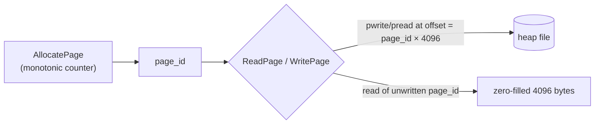

- Fixed 4096-byte pages, matching the common OS page/sector size.
- `pread`/`pwrite` with an explicit offset, not `seek` + `read`/`write`, so
  concurrent I/O from multiple threads needs no external locking.
- No implicit fsync on write; durability needs an explicit `Sync()`.
- One heap file for all pages, not per-table files (matches SQLite).
- Errors are exceptions (`IOException`), not error codes.

## Phase 1: Buffer Pool Manager

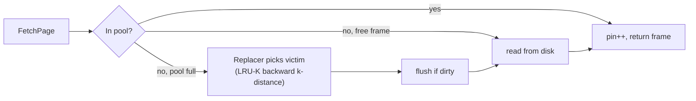

- LRU-K (k=2) is the production eviction policy. A frame with fewer than k
  accesses has infinite backward distance and is evicted first, regardless
  of how recent that one touch was. Reference: O'Neil, O'Neil & Weikum,
  SIGMOD 1993.
- Plain LRU (`LRUReplacer`) exists only as a benchmark baseline, behind the
  same `Replacer` interface.
- `Replacer` only knows frame IDs and evictable/non-evictable;
  `BufferPoolManager` owns all page/disk state.
- One mutex over the whole pool, no per-page latches yet (see Deferred).
- `Evict()` is O(evictable frames): `BM_Zipfian_LRUK` goes from ~63ms at
  pool size 8 to ~729ms at pool size 2048, almost all linear scan.

## Phase 2: B+-Tree (Engine A)

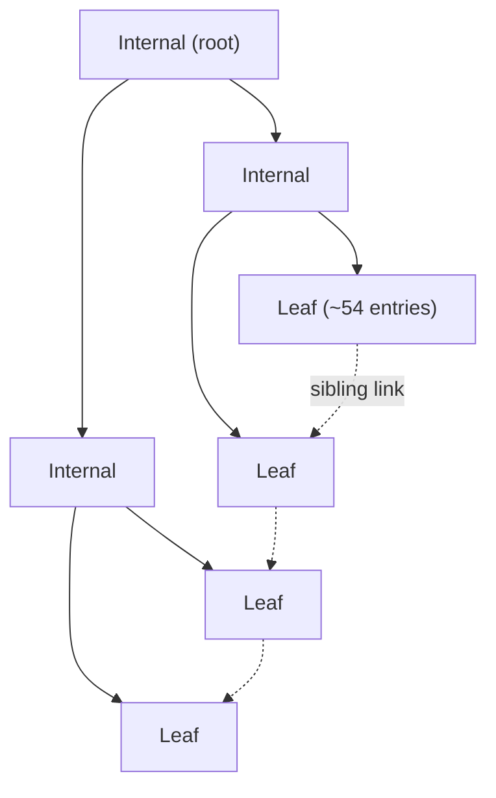

- Fixed `int64_t` keys, values capped at `MAX_VALUE_SIZE` (64 bytes) — the
  same cap the LSM-tree uses, so the head-to-head benchmark stays
  apples-to-apples.
- Node classes overlay directly on a `Page`'s byte buffer
  (`reinterpret_cast`, no vtable, no serialize step): the in-memory layout
  is the wire format.
- `Insert` is upsert, not insert-or-fail.
- One mutex for the whole tree; no latch crabbing yet.
- Benchmarked with shuffled (not sequential) insertion and a buffer pool
  smaller than the dataset, so results aren't flattered.

## Phase 3: LSM-Tree (Engine B)

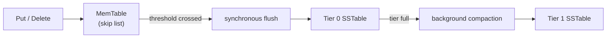
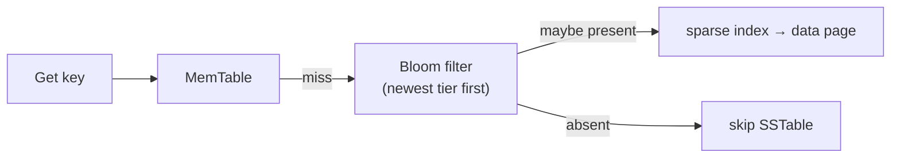

- Skip list and Bloom filter are original implementations, not vendored
  (Pugh 1990; Kirsch & Mitzenmacher 2006 double hashing).
- Each SSTable is its own file; `shared_ptr<SSTable>` keeps a superseded
  file alive for any reader still using it.
- Tombstones drop only at the bottommost populated tier (same rule
  RocksDB uses).
- **Bug found by stress testing**: a fast write loop starved the
  compaction thread, overflowing a tier's manifest capacity about 1 run in
  20. Fixed with write-stall backpressure — the writer itself compacts
  once `kWriteStallTierSize` is crossed.

## Phase 4: Write-Ahead Log & ARIES-Style Recovery

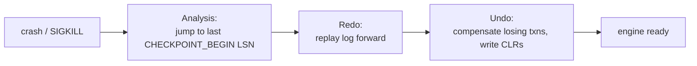

- Logging is logical ("Put(key, new_value)"), not physical — matches the
  ARIES paper's own prescription for tree-structured indexes, where a
  page's byte layout can change after a split.
- No per-page LSNs or dirty-page table; checkpoints are "sharp" (flush
  every dirty page synchronously).
- Undo is per-transaction and key-scoped, not globally LSN-interleaved,
  since it's logical rather than physical.
- **Bug found by the recovery-time benchmark**: recovery scanned the
  entire log to find the last checkpoint, defeating the point of
  checkpointing. Fixed by persisting the checkpoint's LSN in a metadata
  page.
- **Bug avoided by design**: a single shared memtable-WAL file truncated
  on flush had a real data-loss window against concurrent writers. Fixed
  with a per-generation WAL file, rotated atomically with the memtable
  swap.
- Crash-injection harness uses a real `fork`/`SIGKILL`, bracketing each
  attempt with fsynced 'A'/'C' markers so the oracle itself can't produce
  a false failure racing the kill.

## Phase 5: MVCC Concurrency

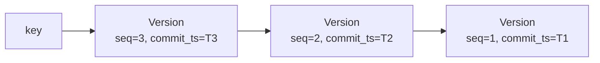

| Isolation level | Dirty read | Non-repeatable read | Write skew |
|---|---|---|---|
| `READ_UNCOMMITTED` | visible | visible | visible |
| `READ_COMMITTED` | prevented | visible | visible |
| `SNAPSHOT` | prevented | prevented | visible (textbook SI) |
| `SERIALIZABLE_SNAPSHOT` | prevented | prevented | prevented |

- `MVCCStore` is deliberately not a `StorageEngine` — a separate,
  in-memory component with its own `Begin`/`Read`/`Write`/`Commit`/`Abort`
  API.
- Snapshot isolation doesn't prevent write skew (Berenson et al. 1995);
  `SERIALIZABLE_SNAPSHOT` is a simplified SSI-lite that also checks the
  read set at commit time, closing the classic two-key write-skew
  pattern without a full rw-antidependency graph.
- Version chains (`std::list<Version>`) give O(1) commit/abort via a
  stable iterator, instead of a linear re-search.
- Commit-time conflict detection is first-committer-wins, chains locked
  in sorted key order to rule out deadlock without a detector.
- GC tracks every active transaction's `start_ts`, not just the oldest,
  so it reclaims a version the moment no active reader could still see it.
- **Bug found by the throughput benchmark**: one global mutex on the
  transaction table undid fine-grained per-key locking (450k/s → 168k/s
  from 1 to 4 threads). Fixed by sharding the table 16 ways by
  `txn_id % 16`.
- Concurrency contract: one thread drives a given `txn_id` at a time.

## Phase 6: SQL Front-End & Tiny Optimizer

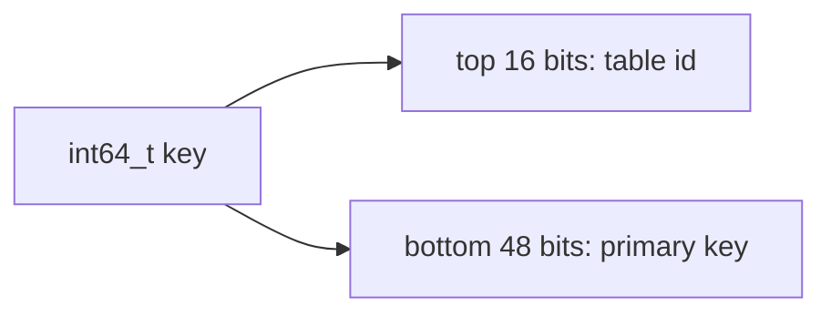
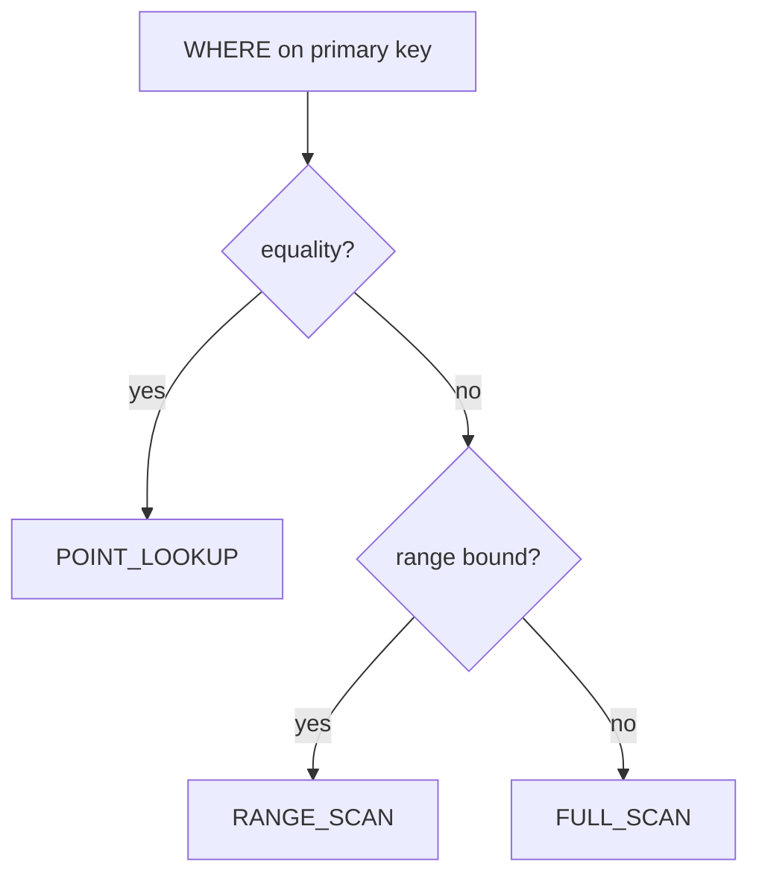

- Every table shares one `StorageEngine`; ascending key order groups a
  table's rows contiguously, so a scan stops the moment the table ID
  changes.
- The primary key is the only indexable column (`KeyType` is a single
  `int64_t` project-wide) — that's what collapses access-path choice to
  the three cases above.
- Grammar: `CREATE TABLE` / `INSERT` / `SELECT` / `DELETE`, `WHERE` as an
  AND-conjunction only. No `UPDATE` (every `Put` is already an upsert),
  no `OR`, no joins, no aggregates.
- Row encoding is fixed, non-nullable, capped at `MAX_VALUE_SIZE`;
  `INTEGER` is 8 raw bytes, `TEXT` a 2-byte length prefix plus bytes.
- Catalog is in-memory only and doesn't persist across a `Database`
  restart — an intentional scope cut (see Phase 8).
- The CLI's `sql` command uses a separate file (`db_path + ".sql"`) from
  the raw page commands, since they share no notion of the SQL layer's
  key-prefixing scheme.

## Phase 7: Validation, Differential Testing & TPC-Style Workloads

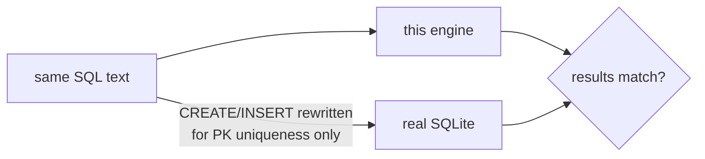

- SQLite is linked only inside `if(DBENGINE_BUILD_TESTS)`, the same role
  GoogleTest/Benchmark play — the runtime Docker image has zero SQLite
  dependency (confirmed with `ldd`).
- This project treats column 0 as an implicit, always-enforced primary
  key; bare SQL doesn't. Fix: rewrite only `CREATE TABLE`/`INSERT` sent
  to SQLite (`INTEGER` → `INTEGER PRIMARY KEY`, `INSERT` →
  `INSERT OR REPLACE`). `SELECT`/`DELETE` go unmodified.
- **What this looked like as a bug before the fix**: SQLite returned
  multiple rows for one key after a randomized insert/delete sequence —
  correct behavior given ordinary SQL semantics, and the reason
  differential testing against an independent implementation is worth
  doing.
- "TPC-C-style"/"TPC-H-style" mean inspired by, not compliant with, the
  official specs — this project's SQL layer has no `UPDATE`, joins,
  `GROUP BY`, or aggregates.

## Phase 8: Deployment

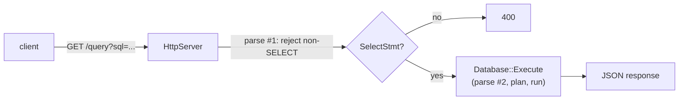

- Three deliverables, all thin layers over existing work: a GHCR image, a
  static hand-written results page, and this read-only HTTP API.
- HTTP is raw POSIX sockets (poll-based, single-threaded), not an
  external framework — same "hand-write it, it's small" call as the SQL
  lexer.
- Read-only is enforced by parsing twice: once to reject non-`SELECT`,
  once to actually run it. Costs microseconds against milliseconds of
  network I/O.
- Catalog non-persistence becomes directly visible here — a fresh
  `dbengine_httpd` process has no schema even when the row bytes are on
  disk. Fixed with an optional schema-file argument, run once before the
  listener starts.
- **Bug found by the HTTP server's own tests**: `Run()` unconditionally
  set `running_ = true` first, racing a `Stop()` that landed before the
  spawned thread actually started. Fast tests hit it reliably; manual
  `curl` testing never did. Fixed by making `running_{true}` the sole
  initializer, so `Stop()` is a one-way transition.

## Deferred

- Free-page reuse in `BPlusTree`'s on-disk page IDs specifically.
- Group commit / log-buffer batching for the WAL.
- Per-page latching in `BufferPoolManager`, latch crabbing in
  `BPlusTree`, finer-grained locking in `LSMTreeEngine`/
  `WALBPlusTreeEngine`. `MVCCStore`'s per-key locking is this project's
  one example of what that looks like in practice.
- Full Cahill-et-al. Serializable Snapshot Isolation, in place of Phase
  5's simplified `SERIALIZABLE_SNAPSHOT`.
- MVCC version chains persisted to disk / integrated with the WAL.
- O(1)/O(log n) eviction for the replacers, currently a linear scan.
- A shared, global buffer pool cache across an LSM-tree's SSTables,
  instead of one small pool per file.
- A growable manifest log instead of a fixed-capacity manifest page, and
  a growable checkpoint bracket for the WAL.
- Slotted pages / variable-length values for the B+-tree.
- Fuzzy (non-blocking) checkpoints for the WAL.
- A persisted catalog, so SQL tables survive a `Database` restart.
- Secondary indexes, `UPDATE`, `OR`/parenthesized `WHERE`, joins,
  aggregates, and nullable columns in the SQL layer.
- One `StorageEngine`/file per SQL table, instead of the shared table-ID
  keyspace every table currently lives in.
- Transactional SQL statements: wiring the WAL's or MVCC's `Begin`/
  `Commit`/`Abort` into the SQL front-end.
- Literal TPC-C/TPC-H compliance, and the joins/`GROUP BY`/aggregates
  that would require.
- Multi-threaded request handling for `HttpServer`.
- A real fix for `dbengine_httpd`'s schema-file workaround: a persisted
  catalog would make it unnecessary.
- HTTPS/TLS, authentication, and rate-limiting for the HTTP API.

## References

- CMU 15-445/645, *Database Systems* (Andy Pavlo). Course structure and
  BusTub's project sequence, used as an architectural reference only.
- Hellerstein, Stonebraker & Hamilton, *Architecture of a Database
  System*, Foundations and Trends in Databases (2007).
- O'Neil, O'Neil & Weikum, "The LRU-K Page Replacement Algorithm For
  Database Disk Buffering," SIGMOD 1993.
- Pugh, "Skip Lists: A Probabilistic Alternative to Balanced Trees,"
  Communications of the ACM (1990).
- Kirsch & Mitzenmacher, "Less Hashing, Same Performance: Building a
  Better Bloom Filter," ESA 2006.
- Mohan et al., "ARIES: A Transaction Recovery Method Supporting
  Fine-Granularity Locking and Partial Rollbacks Using Write-Ahead
  Logging," ACM TODS (1992).
- Berenson et al., "A Critique of ANSI SQL Isolation Levels," SIGMOD 1995.
- Fekete et al., "Making Snapshot Isolation Serializable," ACM TODS (2005).
- Cahill, Rohm & Fekete, "Serializable Isolation for Snapshot Databases,"
  SIGMOD 2008.
