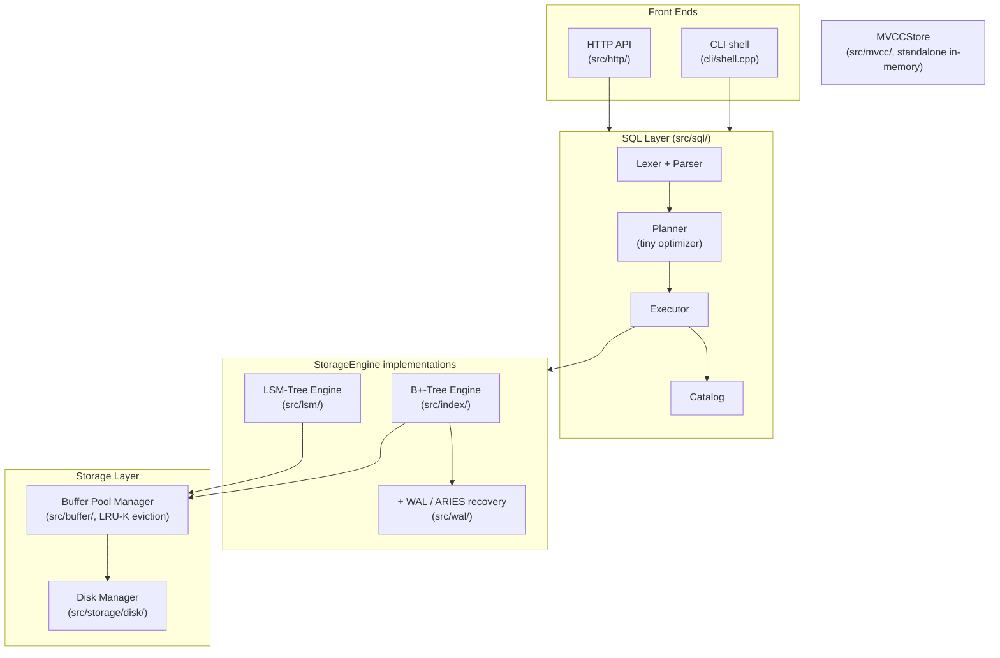

# cpp-database-engine

A disk-backed relational database engine built from scratch in modern C++20 — two storage engines, ARIES crash recovery, MVCC, and a SQL front-end, each with its own benchmark.

[](https://github.com/kavyasridhar1501/cpp-database-engine/actions/workflows/ci.yml)
[](LICENSE)


## Overview

`cpp-database-engine` is a database engine built entirely from scratch — no
external database libraries, no ORM, no borrowed storage engine. It exists as
a from-first-principles answer to "how does a real database actually work,"
built the way a course like CMU 15-445 teaches it: a page-oriented disk
manager and buffer pool underneath, two competing storage engines (a
disk-backed B+-tree and an LSM-tree) compared head-to-head behind one
interface, ARIES-style write-ahead logging and crash recovery, multi-version
concurrency control, and a small SQL front-end with a real (if intentionally
tiny) cost-based query optimizer on top.

The guiding rule throughout: every design decision is backed by a
reproducible benchmark, not a hand-wave, and every correctness claim is
backed by a test — including a harness that really does `fork()` a live
process and `SIGKILL` it at random points hundreds of times to prove crash
recovery, and a differential-testing suite that runs identical SQL against
this engine and a real SQLite to check the answers agree. Architecture is
informed by CMU 15-445 and Hellerstein, Stonebraker & Hamilton's
*Architecture of a Database System* (2007) — the code itself is
original, not derived from BusTub. Full trade-off reasoning for every
decision lives in [DESIGN.md](DESIGN.md); every benchmark result and how to
reproduce it lives in [BENCHMARKS.md](BENCHMARKS.md).

## Demo

There's no GUI — this is a systems project, not a product — but here's what
using it looks like end to end.

**A results page** with this project's headline benchmark numbers is
published via GitHub Pages:
**[kavyasridhar1501.github.io/cpp-database-engine](https://kavyasridhar1501.github.io/cpp-database-engine/)**

**The SQL shell**, live:
```
$ ./build/src/dbengine_cli mydata.db
db> sql CREATE TABLE users (id INTEGER, name TEXT, age INTEGER)
CREATE TABLE
db> sql INSERT INTO users VALUES (1, 'alice', 30)
INSERT 1
db> sql SELECT * FROM users WHERE age >= 18
id | name | age
1 | alice | 30
SELECT 1
```

**The read-only HTTP API**, live:
```
$ curl 'http://localhost:8080/query?sql=SELECT%20*%20FROM%20users%20WHERE%20id%20%3D%201'
{"columns":["id","name","age"],"rows":[[1,"alice",30]],"rows_affected":1,"message":"SELECT 1"}
```

## Features

- **Two storage engines behind one `StorageEngine` interface** — a
  disk-backed B+-tree (page-overlaid nodes, splits/merges, range scans) and
  an LSM-tree (skip-list memtable, Bloom-filtered SSTables, size-tiered
  compaction) — swappable and benchmarked head-to-head, not just built and
  set aside.
- **A buffer pool manager with LRU-K eviction**, proven to beat plain LRU on
  a Zipfian access trace at every pool size tested.
- **ARIES-style write-ahead logging and crash recovery** — logical
  redo/undo, Compensation Log Records, checkpointing, and an
  Analysis→Redo→Undo restart algorithm — validated with a real
  `fork()`/`SIGKILL()` crash-injection harness, not just a simulated crash.
- **MVCC with four isolation levels**, including a deterministic test suite
  that makes dirty reads, non-repeatable reads, and write skew appear under
  weak isolation and vanish under the appropriate stronger one.
- **A small SQL front-end with a real access-path optimizer** — a
  hand-written lexer and recursive-descent parser, and a planner that
  picks between a point lookup, a range scan, or a full scan depending on
  what the query's `WHERE` clause can use — worth ~3,700x at 100k rows in
  the benchmark that proves it.
- **Differential testing against a real SQLite** and TPC-C-/TPC-H-*inspired*
  workloads, for validation beyond this project's own test suite.
- **A read-only HTTP API and a published container image** — see
  [Usage](#usage) and [Deployment](#deployment).

## Tech stack

| | |
|---|---|
| Language | C++20 |
| Build system | CMake ≥ 3.16 |
| Testing | GoogleTest (parametrized + randomized-oracle tests) |
| Benchmarking | Google Benchmark |
| Validation oracle (test-only) | SQLite3, linked via `find_package`, never shipped in the engine |
| Networking | Raw POSIX sockets (no web framework) |
| CI/CD | GitHub Actions, GHCR, GitHub Pages |
| Containerization | Docker (multi-stage build) |

No external database libraries, ORMs, or storage-engine dependencies
anywhere in the shipped engine — see [DESIGN.md](DESIGN.md) for the one
deliberate, test-only exception (SQLite, used purely as a differential-testing
oracle) and why it doesn't compromise that rule.

## Installation / Setup

**Prerequisites:** CMake ≥ 3.16, a C++20 compiler (GCC 12+ or Clang 15+).
GoogleTest and Google Benchmark are fetched automatically via
`FetchContent` — nothing to install for those. Optional: `libsqlite3-dev`
(Debian/Ubuntu) if you want the SQLite differential test suite to build;
without it, that one test file is skipped and everything else builds fine.

```sh
git clone https://github.com/kavyasridhar1501/cpp-database-engine.git
cd cpp-database-engine
cmake -S . -B build -DCMAKE_BUILD_TYPE=Release
cmake --build build --parallel
```

Or with Docker, no local toolchain needed:
```sh
docker build -t dbengine .
docker run --rm -it -v dbengine-data:/home/dbengine/data dbengine
```

## Usage

### CLI shell

```sh
./build/src/dbengine_cli [path-to-db-file]
```

```
db> alloc
allocated page 0
db> write 0 hello world
wrote 11 bytes to page 0
db> read 0
page 0: hello world
db> stats
pages allocated: 1
disk reads:      1
disk writes:     1
db> sql CREATE TABLE users (id INTEGER, name TEXT, age INTEGER)
CREATE TABLE
db> sql INSERT INTO users VALUES (1, 'alice', 30)
INSERT 1
db> sql SELECT * FROM users WHERE id = 1
id | name | age
1 | alice | 30
SELECT 1
```

`alloc`/`write`/`read`/`stats` operate on raw pages directly; `sql` runs one
SQL statement (`CREATE TABLE` / `INSERT` / `SELECT` / `DELETE`) against a
separate SQL-managed file so the two never collide.

### HTTP API

```sh
./build/src/dbengine_httpd [db-file] [port] [schema-file]
```

`schema-file` is optional: one SQL statement per line (`--`-prefixed lines
are comments), run once at startup before the server accepts connections —
see [Configuration](#configuration) for why this exists.

```sh
$ cat seed.sql
CREATE TABLE users (id INTEGER, name TEXT, age INTEGER)
INSERT INTO users VALUES (1, 'alice', 30)

$ ./build/src/dbengine_httpd data.db 8080 seed.sql &
$ curl http://localhost:8080/health
ok
$ curl 'http://localhost:8080/query?sql=SELECT%20*%20FROM%20users'
{"columns":["id","name","age"],"rows":[[1,"alice",30]],"rows_affected":1,"message":"SELECT 1"}
```

Only `SELECT` is accepted over the API — anything else (`INSERT`,
`DELETE`, `CREATE TABLE`) is rejected with a 400 before it ever reaches the
engine.

### Benchmarks

```sh
./build/benchmark/dbengine_bench --benchmark_filter=<regex>
```

See [BENCHMARKS.md](BENCHMARKS.md) for the full reproduction command for
every result and how to interpret it.

## Configuration

There are no environment variables, API keys, or secrets anywhere in this
project — everything is configured via CMake options or command-line
arguments:

| Setting | How | Default |
|---|---|---|
| Build tests | `-DDBENGINE_BUILD_TESTS=ON/OFF` | `ON` |
| Build benchmarks | `-DDBENGINE_BUILD_BENCHMARKS=ON/OFF` | `ON` |
| CLI db file | `dbengine_cli [path]` | `dbengine.db` |
| HTTP API db file / port / schema file | `dbengine_httpd [db-file] [port] [schema-file]` | `dbengine_httpd.db` / `8080` / none |

The HTTP API's optional schema file exists because the SQL layer's table
catalog is in-memory only and doesn't persist across a restart (a
documented, deliberate scope cut — see DESIGN.md's Phase 6 and 8 sections):
without it, a freshly started `dbengine_httpd` has no way to know what
tables already exist on disk. Loading it happens once, locally, before the
server starts listening — nothing about it is reachable over the network,
so the API's read-only guarantee holds regardless.

## Architecture



Every table in the SQL layer shares **one** `StorageEngine` instance,
namespaced by a table-id key prefix, rather than owning its own file — a
deliberate simplification (see DESIGN.md's Phase 6 section) that kept that
phase focused on parsing and planning rather than per-table file
management. `MVCCStore` is intentionally *not* wired into the SQL layer —
it's a separate, in-memory component demonstrating snapshot isolation on
its own terms, since the disk engines' durability story (WAL/ARIES) and
MVCC's concurrency story are orthogonal problems this project solved
independently rather than conflating (see DESIGN.md's Phase 5 section).

For the full reasoning behind every box in this diagram — why the buffer
pool uses LRU-K instead of plain LRU, why logging is logical instead of
physical, why the optimizer only ever has three access paths to choose
from — see [DESIGN.md](DESIGN.md), which has one section per phase.

## Testing

```sh
ctest --test-dir build --output-on-failure
```

**201 tests**, organized around a few different techniques rather than
just line coverage (no `gcov`/`lcov` line-coverage report is wired up yet —
see [Roadmap](#roadmap--future-work)):

- **Randomized oracle tests** for every storage engine (B+-tree, LSM-tree,
  the SQL layer running against both) and for `MVCCStore`: thousands of
  random `Insert`/`Delete`/`Get` operations checked against a reference
  `std::map` or `std::vector`.
- **A crash-injection harness** (`test/crash/`): forks a real worker
  process, lets it run for a random 1-50ms, sends it a real `SIGKILL`, and
  verifies recovered state against an independent oracle log — 150 cycles
  against the B+-tree and 100 against the LSM-tree, on every push. Not a
  simulated crash: an in-process "pretend crash" can't bypass RAII cleanup
  the way an actual `kill -9` does, so this project doesn't try.
- **Differential testing against a real SQLite** (`test/validation/`,
  test-only dependency): identical SQL text run against both engines,
  results compared directly, including a 2,000-operation randomized fuzzer.
- **Deterministic concurrency tests**: forced interleavings that make
  dirty reads, non-repeatable reads, and write skew appear under weak
  isolation and vanish under the correct stronger one, plus a real
  multi-threaded no-lost-updates stress test for MVCC's conflict detection.
- **A real-socket HTTP test suite** for the API layer, covering routing,
  JSON responses, read-only enforcement, and error handling — the kind of
  test that caught a genuine `Stop()`/`Run()` race condition the engine's
  own logic never had (see DESIGN.md's Phase 8 section for the story).

## Roadmap / Future work

All 8 originally planned phases are complete (see below). What's
deliberately deferred, in rough order of impact — full reasoning for each
is in [DESIGN.md](DESIGN.md)'s "Deferred to later phases" section:

- Secondary indexes, `JOIN`, `GROUP BY`/aggregates, and `UPDATE` in the SQL
  layer — the largest gap between this project's grammar and a real SQL
  engine (or literal TPC-H compliance).
- A persisted catalog, so the SQL layer's tables survive a `Database`
  restart without re-running `CREATE TABLE`.
- Transactional SQL statements — wiring the WAL's or MVCC's
  `Begin`/`Commit`/`Abort` into the SQL front-end for real multi-statement
  atomicity and isolation.
- Full Cahill-et-al. Serializable Snapshot Isolation, replacing the
  simplified conservative check `SERIALIZABLE_SNAPSHOT` uses today.
- Group commit / log-buffer batching for the WAL, to amortize fsync cost
  across concurrent commits.
- Finer-grained locking in the disk engines (`MVCCStore`'s per-key
  locking is this project's one example of what that looks like).
- Line/branch coverage reporting (`gcov`/`lcov`) wired into CI.
- Authentication, TLS, and rate-limiting for the HTTP API, which is
  explicitly demo-scale today, not hardened for exposure beyond a trusted
  network.

## Contributing

This started as a solo, phase-by-phase learning project, but issues and
pull requests are welcome.

- **Branching**: fork the repo and branch off `main` (`feature/<short-name>`
  or `fix/<short-name>`); the project's own history uses one branch per
  development phase, which doesn't need to be your convention.
- **Before opening a PR**: `ctest --test-dir build --output-on-failure`
  must be green, and the build must stay warning-clean
  (`-Wall -Wextra -Wpedantic`, already the default). Add tests for new
  behavior in the same style as the existing suite (see
  [Testing](#testing)) — a randomized oracle test if you're touching a
  storage engine, a deterministic interleaving test if you're touching
  concurrency.
- **Code style**: match what's there — minimal comments (only for
  non-obvious *why*, never restating *what* the code does), no
  speculative abstraction ahead of an actual second use case, and a design
  note in [DESIGN.md](DESIGN.md) for any non-trivial trade-off, in the
  same style as the existing phase-by-phase entries.
- **Scope**: if you're proposing something from the Roadmap above, a short
  issue describing your approach before a large PR is appreciated —
  several of this project's own design decisions turned out to need
  revisiting after a benchmark or test exposed a gap, and it's easier to
  have that conversation before the code is written than after.

## License

MIT — see [LICENSE](LICENSE).

## Acknowledgments / References

Architecture is informed by, but not derived from, the following — this
project's code is original throughout:

- CMU 15-445/645, *Database Systems* (Andy Pavlo) — course structure and
  BusTub's project sequence, used as an architectural reference only.
- Hellerstein, Stonebraker & Hamilton, *Architecture of a Database System*,
  Foundations and Trends in Databases (2007).
- O'Neil, O'Neil & Weikum, "The LRU-K Page Replacement Algorithm For
  Database Disk Buffering," SIGMOD 1993.
- Pugh, "Skip Lists: A Probabilistic Alternative to Balanced Trees,"
  Communications of the ACM (1990).
- Mohan et al., "ARIES: A Transaction Recovery Method Supporting
  Fine-Granularity Locking and Partial Rollbacks Using Write-Ahead
  Logging," ACM TODS (1992).
- Berenson et al., "A Critique of ANSI SQL Isolation Levels," SIGMOD 1995.
- Fekete et al., "Making Snapshot Isolation Serializable," ACM TODS (2005).
- Cahill, Röhm & Fekete, "Serializable Isolation for Snapshot Databases,"
  SIGMOD 2008.
- [GoogleTest](https://github.com/google/googletest) and
  [Google Benchmark](https://github.com/google/benchmark) — test and
  benchmark infrastructure only, fetched via CMake `FetchContent`.
- [SQLite](https://www.sqlite.org/) — linked test-only, as a differential-
  testing oracle (see DESIGN.md's Phase 7 section); never shipped in the
  engine.

## Contact

- Email: [kavyasridhar2001@gmail.com](mailto:kavyasridhar2001@gmail.com)
- GitHub: [@kavyasridhar1501](https://github.com/kavyasridhar1501)

## Why I built this

I wanted to actually understand how a database works below the SQL layer,
not just use one — and the best way to find out whether you understand
something is to build it and see where it breaks. A few things this
project cares about more than a typical class project might:

- **A head-to-head comparison, not just two implementations.** Building a
  B+-tree and an LSM-tree side by side, behind one interface, with the
  same benchmark harness, is what actually shows *when* each one wins
  instead of asserting it from a textbook.
- **Measurability over feature count.** Several of the most interesting
  findings in this project weren't planned — they were bugs a benchmark or
  test surfaced that a design review wouldn't have caught: a compaction
  thread that could be starved by a fast writer, a checkpoint mechanism
  that didn't actually bound recovery time the way it was supposed to, a
  transaction-table mutex that quietly undid the point of fine-grained
  MVCC locking, an HTTP server race that only a real concurrent test (not
  manual `curl`-ing) would ever hit. Each one is written up honestly in
  [DESIGN.md](DESIGN.md), including the fix.
- **Saying no to scope, out loud.** The SQL layer doesn't support joins or
  aggregates; the TPC-C/TPC-H benchmarks are explicitly labeled *inspired
  by*, not compliant with, the official specs; snapshot isolation is shown
  *not* preventing write skew because that's what the literature actually
  says, rather than fudging the demo to match a simpler story. A project
  that's honest about what it didn't build is more useful, to me and to
  anyone reading it, than one that quietly papers over the gaps.

Full trade-off reasoning for every decision above — not just the headline
ones — is in [DESIGN.md](DESIGN.md).
