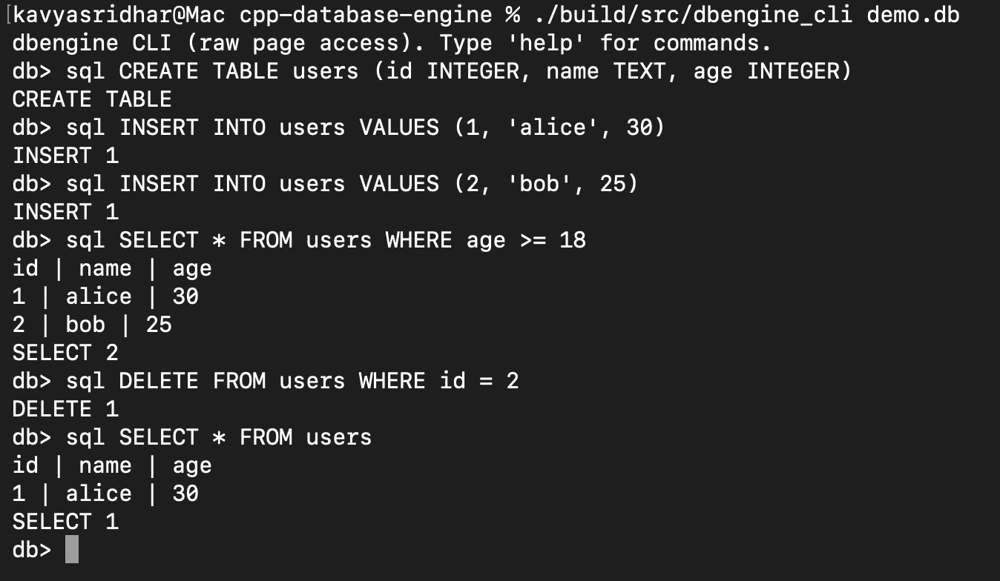
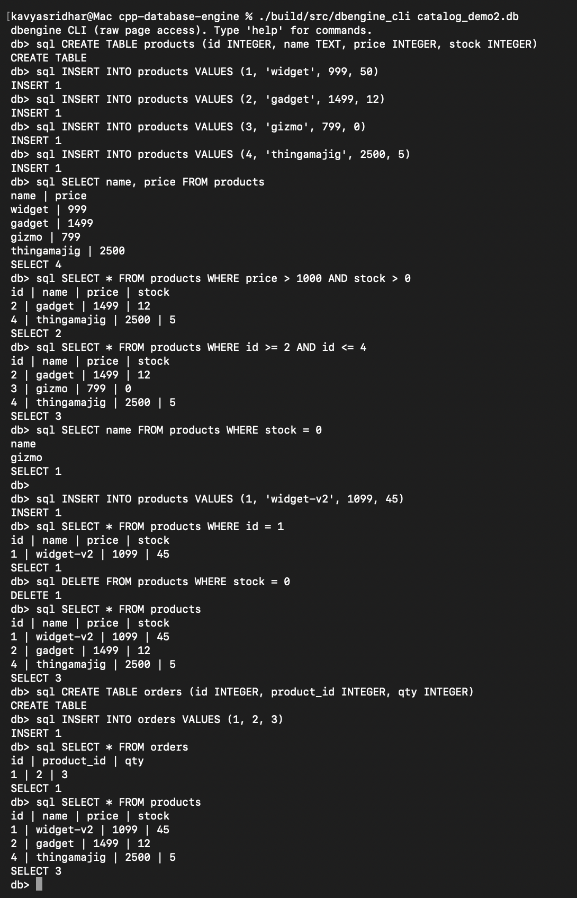
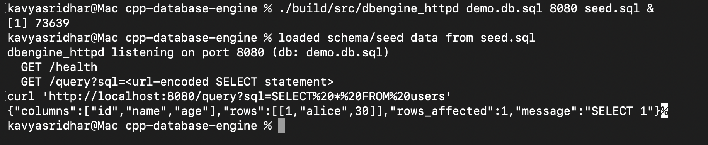
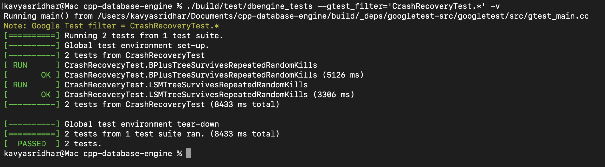
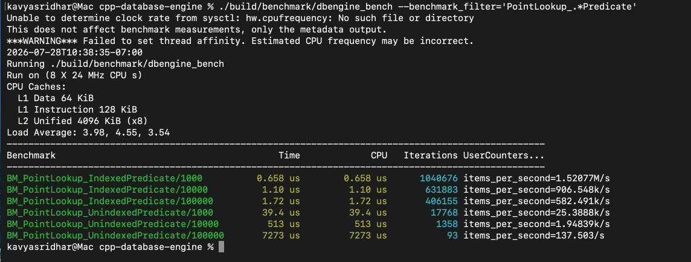
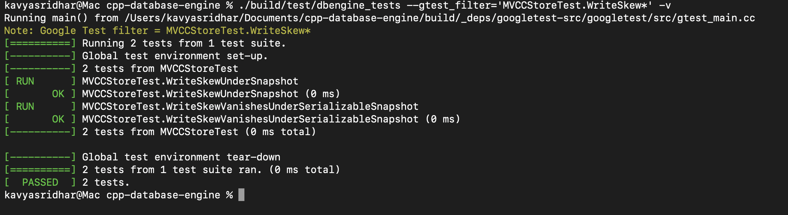
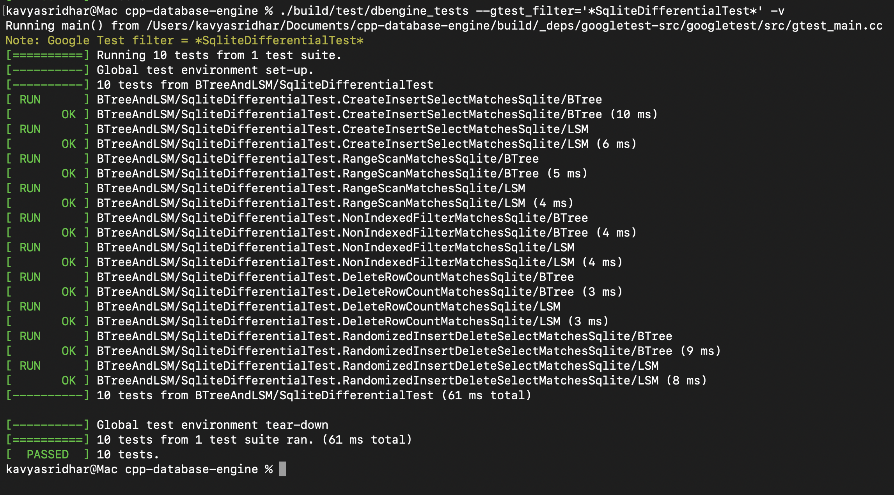
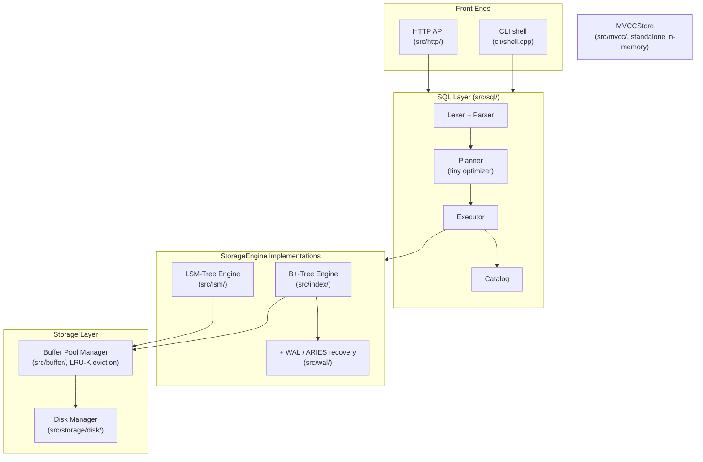

# cpp-database-engine

A disk-backed relational database engine built from scratch in C++20: two
storage engines, ARIES crash recovery, MVCC, and a SQL front-end, each with
its own benchmark.

[](https://github.com/kavyasridhar1501/cpp-database-engine/actions/workflows/ci.yml)
[](LICENSE)


## Overview

`cpp-database-engine` is built entirely from scratch. No external database
libraries, no ORM, no borrowed storage engine.

- A page-oriented disk manager and buffer pool underneath.
- Two competing storage engines, a disk-backed B+-tree and an LSM-tree,
  compared head-to-head behind one interface.
- ARIES-style write-ahead logging and crash recovery.
- Multi-version concurrency control (MVCC).
- A small SQL front-end with a real, intentionally tiny, cost-based query
  optimizer.

Every design decision is backed by a reproducible benchmark. Every
correctness claim is backed by a test, including:
- A harness that forks a live process and `SIGKILL`s it at random points
  hundreds of times, to prove crash recovery.
- A differential-testing suite that runs identical SQL against this engine
  and a real SQLite and checks the answers agree.

- Trade-off reasoning for every decision: [DESIGN.md](DESIGN.md)
- Every benchmark result and how to reproduce it: [BENCHMARKS.md](BENCHMARKS.md)

## Demo

### SQL shell

```
$ ./build/src/dbengine_cli mydata.db
db> sql CREATE TABLE users (id INTEGER, name TEXT, age INTEGER)
CREATE TABLE
db> sql INSERT INTO users VALUES (1, 'alice', 30)
INSERT 1
db> sql SELECT * FROM users WHERE age >= 18
id | name | age
1 | alice | 30
SELECT 1
```



### Grammar coverage: multi-condition queries, multiple tables, and clean rejection of unsupported SQL

```sh
rm -f catalog_demo.db*
./build/src/dbengine_cli catalog_demo.db <<'EOF'
sql CREATE TABLE products (id INTEGER, name TEXT, price INTEGER, stock INTEGER)
sql INSERT INTO products VALUES (1, 'widget', 999, 50)
sql INSERT INTO products VALUES (2, 'gadget', 1499, 12)
sql INSERT INTO products VALUES (3, 'gizmo', 799, 0)
sql INSERT INTO products VALUES (4, 'thingamajig', 2500, 5)
sql SELECT name, price FROM products
sql SELECT * FROM products WHERE price > 1000 AND stock > 0
sql SELECT * FROM products WHERE id >= 2 AND id <= 4
sql SELECT name FROM products WHERE stock = 0
sql INSERT INTO products VALUES (1, 'widget-v2', 1099, 45)
sql SELECT * FROM products WHERE id = 1
sql DELETE FROM products WHERE stock = 0
sql SELECT * FROM products
sql CREATE TABLE orders (id INTEGER, product_id INTEGER, qty INTEGER)
sql INSERT INTO orders VALUES (1, 2, 3)
sql SELECT * FROM orders
sql SELECT * FROM products
sql SELECT * FROM products, orders WHERE products.id = orders.product_id
sql SELECT COUNT(*) FROM products
sql INSERT INTO products VALUES (-1, 'bad', 100, 1)
exit
EOF
```

Column projection, multi-condition `WHERE`, upsert-on-reinsert, range queries,
and two tables in one database, followed by the grammar's edges (joins,
aggregates, and a negative primary key) rejected cleanly instead of crashing.



### Read-only HTTP API

```
$ ./build/src/dbengine_httpd mydata.db.sql 8080 seed.sql &
$ curl 'http://localhost:8080/query?sql=SELECT%20*%20FROM%20users'
{"columns":["id","name","age"],"rows":[[1,"alice",30]],"rows_affected":1,"message":"SELECT 1"}
```



### Crash recovery, proven with a real `SIGKILL`

```
$ ./build/test/dbengine_tests --gtest_filter='CrashRecoveryTest.*' -v
```



### The optimizer payoff

```
$ ./build/benchmark/dbengine_bench --benchmark_filter='PointLookup_.*Predicate'
```



### MVCC write skew: appears under `SNAPSHOT`, vanishes under `SERIALIZABLE_SNAPSHOT`

```
$ ./build/test/dbengine_tests --gtest_filter='MVCCStoreTest.WriteSkew*' -v
```



### Differential testing against real SQLite

```
$ ./build/test/dbengine_tests --gtest_filter='*SqliteDifferentialTest*' -v
```



## Features

- **Two storage engines, one interface.** A disk-backed B+-tree and an
  LSM-tree, swappable behind `StorageEngine`, benchmarked head-to-head.
- **LRU-K buffer pool.** Beats plain LRU on a Zipfian trace at every pool
  size tested.
- **ARIES-style crash recovery.** Logical redo/undo, checkpointing,
  restart recovery, validated with a real `SIGKILL` crash-injection
  harness.
- **MVCC, four isolation levels.** Dirty reads, non-repeatable reads, and
  write skew appear under weak isolation and vanish under the right
  stronger one, deterministically.
- **A tiny SQL front-end with a real optimizer.** Picks between a point
  lookup, range scan, or full scan based on `WHERE`. ~3,700x faster at
  100k rows when it picks right.
- **Validated beyond its own tests.** Differential testing against real
  SQLite, plus TPC-C/TPC-H-inspired workloads.
- **A read-only HTTP API and a Docker image**, both runnable locally. See
  [Usage](#usage).

## Tech stack

| | |
|---|---|
| Language | C++20 |
| Build system | CMake 3.16+ |
| Testing | GoogleTest, parametrized and randomized-oracle tests |
| Benchmarking | Google Benchmark |
| Validation oracle (test-only) | SQLite3, linked via `find_package`, never shipped in the engine |
| Networking | Raw POSIX sockets, no web framework |
| CI | GitHub Actions (build + test on every push) |
| Containerization | Docker, multi-stage build |

No external database libraries, ORMs, or storage-engine dependencies in
the shipped engine. See [DESIGN.md](DESIGN.md) for the one test-only
exception (SQLite as a differential-testing oracle) and why it doesn't
break that rule.

## Installation / Setup

Prerequisites: CMake 3.16+, a C++20 compiler (GCC 12+ or Clang 15+).
GoogleTest and Google Benchmark fetch automatically via `FetchContent`.
Optional: `libsqlite3-dev` (Debian/Ubuntu) for the SQLite differential
test suite. Without it, that one test file is skipped and everything
else builds fine.

```sh
git clone https://github.com/kavyasridhar1501/cpp-database-engine.git
cd cpp-database-engine
cmake -S . -B build -DCMAKE_BUILD_TYPE=Release
cmake --build build --parallel
```

With Docker, no local toolchain needed:
```sh
docker build -t dbengine .
docker run --rm -it -v dbengine-data:/home/dbengine/data dbengine
```

## Usage

### CLI shell

```sh
./build/src/dbengine_cli [path-to-db-file]
```

```
db> alloc
allocated page 0
db> write 0 hello world
wrote 11 bytes to page 0
db> read 0
page 0: hello world
db> stats
pages allocated: 1
disk reads:      1
disk writes:     1
db> sql CREATE TABLE users (id INTEGER, name TEXT, age INTEGER)
CREATE TABLE
db> sql INSERT INTO users VALUES (1, 'alice', 30)
INSERT 1
db> sql SELECT * FROM users WHERE id = 1
id | name | age
1 | alice | 30
SELECT 1
```

`alloc`/`write`/`read`/`stats` operate on raw pages directly. `sql` runs
one statement (`CREATE TABLE` / `INSERT` / `SELECT` / `DELETE`) against a
separate SQL-managed file, so the two never collide.

### HTTP API

```sh
./build/src/dbengine_httpd [db-file] [port] [schema-file]
```

`schema-file` is optional: one SQL statement per line (`--`-prefixed lines
are comments), run once at startup before the server accepts connections.
See [Configuration](#configuration) for why this exists.

```sh
$ cat seed.sql
CREATE TABLE users (id INTEGER, name TEXT, age INTEGER)
INSERT INTO users VALUES (1, 'alice', 30)

$ ./build/src/dbengine_httpd data.db 8080 seed.sql &
$ curl http://localhost:8080/health
ok
$ curl 'http://localhost:8080/query?sql=SELECT%20*%20FROM%20users'
{"columns":["id","name","age"],"rows":[[1,"alice",30]],"rows_affected":1,"message":"SELECT 1"}
```

Only `SELECT` is accepted over the API. Anything else (`INSERT`,
`DELETE`, `CREATE TABLE`) gets a 400 before it reaches the engine.

### Benchmarks

```sh
./build/benchmark/dbengine_bench --benchmark_filter=<regex>
```

See [BENCHMARKS.md](BENCHMARKS.md) for the reproduction command for every
result and how to interpret it.

## Configuration

No environment variables, API keys, or secrets anywhere in this project.
Everything configures via CMake options or command-line arguments:

| Setting | How | Default |
|---|---|---|
| Build tests | `-DDBENGINE_BUILD_TESTS=ON/OFF` | `ON` |
| Build benchmarks | `-DDBENGINE_BUILD_BENCHMARKS=ON/OFF` | `ON` |
| CLI db file | `dbengine_cli [path]` | `dbengine.db` |
| HTTP API db file / port / schema file | `dbengine_httpd [db-file] [port] [schema-file]` | `dbengine_httpd.db` / `8080` / none |

The HTTP API's schema file exists because the SQL layer's catalog is
in-memory only and doesn't persist across a restart. Without it, a
freshly started `dbengine_httpd` has no way to know what tables exist on
disk. It loads once, locally, before the server starts listening; nothing
about it is reachable over the network, so the read-only guarantee holds
regardless. Details: [DESIGN.md](DESIGN.md).

## Architecture



- Every table in the SQL layer shares one `StorageEngine` instance,
  namespaced by a table-id key prefix, instead of owning its own file.
- `MVCCStore` is not wired into the SQL layer. It's a separate, in-memory
  component demonstrating snapshot isolation on its own terms.

Full reasoning per phase: [DESIGN.md](DESIGN.md).

## Testing

```sh
ctest --test-dir build --output-on-failure
```

201 tests (no line-coverage report yet, see [Future Work](#future-work)):

- **Randomized oracle tests** for every storage engine and `MVCCStore`,
  checked against a reference `std::map`/`std::vector`.
- **Crash-injection harness**: real `fork`/`SIGKILL` cycles, 150 runs
  against the B+-tree, 100 against the LSM-tree, every push.
- **Differential testing** against real SQLite, including a
  2,000-operation randomized fuzzer.
- **Deterministic concurrency tests**: forced interleavings for dirty
  reads, non-repeatable reads, and write skew, plus a multithreaded
  no-lost-updates stress test.
- **Real-socket HTTP tests**: routing, JSON responses, read-only
  enforcement. Caught a real `Stop()`/`Run()` race condition
  ([DESIGN.md](DESIGN.md)).

## Future Work

All 8 planned phases are complete. Deferred, in [DESIGN.md](DESIGN.md):

- Secondary indexes, `JOIN`, `GROUP BY`/aggregates, `UPDATE` in the SQL layer.
- A persisted catalog, so SQL tables survive a `Database` restart.
- Transactional SQL statements via the WAL's or MVCC's `Begin`/`Commit`/`Abort`.
- Full Cahill-et-al. Serializable Snapshot Isolation.
- Group commit / log-buffer batching for the WAL.
- Finer-grained locking in the disk engines.
- Line/branch coverage reporting in CI.
- Authentication, TLS, and rate-limiting for the HTTP API.

## Why I built this

I wanted to understand how a database works below the SQL layer, not just
use one.

- **Head-to-head, not just two implementations.** Same benchmark harness
  for the B+-tree and LSM-tree, so trade-offs show up as numbers, not
  assertions.
- **Measurability over feature count.** Several bugs were caught by a
  benchmark or test, not a design review: a compaction thread starved by
  a fast writer, a checkpoint that didn't actually bound recovery time, a
  transaction-table mutex undoing MVCC's fine-grained locking, an HTTP
  race only a concurrent test would hit. All written up in
  [DESIGN.md](DESIGN.md).
- **Honest about scope.** No joins or aggregates in the SQL layer.
  TPC-C/TPC-H benchmarks are labeled inspired by, not compliant with, the
  specs. Snapshot isolation is shown not preventing write skew, because
  that's what the literature says.

## Acknowledgments

Architecture is informed by, not derived from, the following:

- CMU 15-445/645, *Database Systems* (Andy Pavlo)
- Hellerstein, Stonebraker & Hamilton, *Architecture of a Database System* (2007)
- O'Neil, O'Neil & Weikum, "The LRU-K Page Replacement Algorithm For Database Disk Buffering," SIGMOD 1993
- Pugh, "Skip Lists: A Probabilistic Alternative to Balanced Trees," CACM 1990
- Mohan et al., "ARIES: A Transaction Recovery Method...," ACM TODS 1992
- Berenson et al., "A Critique of ANSI SQL Isolation Levels," SIGMOD 1995
- Fekete et al., "Making Snapshot Isolation Serializable," ACM TODS 2005
- Cahill, Rohm & Fekete, "Serializable Isolation for Snapshot Databases," SIGMOD 2008

## License

MIT. See [LICENSE](LICENSE).
