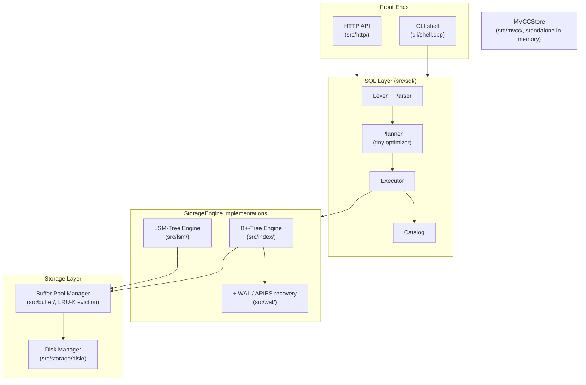

# cpp-database-engine

A disk-backed relational database engine built from scratch in C++20: two
storage engines, ARIES crash recovery, MVCC, and a SQL front-end, each with
its own benchmark.

[](https://github.com/kavyasridhar1501/cpp-database-engine/actions/workflows/ci.yml)
[](LICENSE)


## Overview

`cpp-database-engine` is built entirely from scratch. No external database
libraries, no ORM, no borrowed storage engine.

- A page-oriented disk manager and buffer pool underneath.
- Two competing storage engines, a disk-backed B+-tree and an LSM-tree,
  compared head-to-head behind one interface.
- ARIES-style write-ahead logging and crash recovery.
- Multi-version concurrency control (MVCC).
- A small SQL front-end with a real, intentionally tiny, cost-based query
  optimizer.

Every design decision is backed by a reproducible benchmark. Every
correctness claim is backed by a test, including:
- A harness that forks a live process and `SIGKILL`s it at random points
  hundreds of times, to prove crash recovery.
- A differential-testing suite that runs identical SQL against this engine
  and a real SQLite and checks the answers agree.

Architecture is informed by CMU 15-445 and Hellerstein, Stonebraker &
Hamilton's *Architecture of a Database System* (2007). Code is original,
not derived from BusTub.

- Trade-off reasoning for every decision: [DESIGN.md](DESIGN.md)
- Every benchmark result and how to reproduce it: [BENCHMARKS.md](BENCHMARKS.md)

## Demo

No GUI, no hosted instance. This is a systems project, run it locally.
See [Installation / Setup](#installation--setup) and [Usage](#usage) below
for the exact steps.

SQL shell:
```
$ ./build/src/dbengine_cli mydata.db
db> sql CREATE TABLE users (id INTEGER, name TEXT, age INTEGER)
CREATE TABLE
db> sql INSERT INTO users VALUES (1, 'alice', 30)
INSERT 1
db> sql SELECT * FROM users WHERE age >= 18
id | name | age
1 | alice | 30
SELECT 1
```

Read-only HTTP API:
```
$ curl 'http://localhost:8080/query?sql=SELECT%20*%20FROM%20users%20WHERE%20id%20%3D%201'
{"columns":["id","name","age"],"rows":[[1,"alice",30]],"rows_affected":1,"message":"SELECT 1"}
```

## Features

- Two storage engines behind one `StorageEngine` interface: a disk-backed
  B+-tree (page-overlaid nodes, splits/merges, range scans) and an
  LSM-tree (skip-list memtable, Bloom-filtered SSTables, size-tiered
  compaction). Swappable, and benchmarked head-to-head.
- A buffer pool manager with LRU-K eviction. Beats plain LRU on a Zipfian
  access trace at every pool size tested.
- ARIES-style write-ahead logging and crash recovery: logical redo/undo,
  Compensation Log Records, checkpointing, an Analysis-Redo-Undo restart
  algorithm. Validated with a real `fork()`/`SIGKILL()` crash-injection
  harness, not a simulated crash.
- MVCC with four isolation levels. A deterministic test suite makes dirty
  reads, non-repeatable reads, and write skew appear under weak isolation
  and vanish under the appropriate stronger one.
- A small SQL front-end with a real access-path optimizer: a hand-written
  lexer and recursive-descent parser, and a planner that picks between a
  point lookup, a range scan, or a full scan based on the query's `WHERE`
  clause. Worth ~3,700x at 100k rows in the benchmark that proves it.
- Differential testing against a real SQLite, plus TPC-C/TPC-H-inspired
  workloads, for validation beyond this project's own test suite.
- A read-only HTTP API and a Docker image you can build and run locally.
  See [Usage](#usage).

## Tech stack

| | |
|---|---|
| Language | C++20 |
| Build system | CMake 3.16+ |
| Testing | GoogleTest, parametrized and randomized-oracle tests |
| Benchmarking | Google Benchmark |
| Validation oracle (test-only) | SQLite3, linked via `find_package`, never shipped in the engine |
| Networking | Raw POSIX sockets, no web framework |
| CI | GitHub Actions (build + test on every push) |
| Containerization | Docker, multi-stage build |

No external database libraries, ORMs, or storage-engine dependencies in
the shipped engine. See [DESIGN.md](DESIGN.md) for the one test-only
exception (SQLite as a differential-testing oracle) and why it doesn't
break that rule.

## Installation / Setup

Prerequisites: CMake 3.16+, a C++20 compiler (GCC 12+ or Clang 15+).
GoogleTest and Google Benchmark fetch automatically via `FetchContent`.
Optional: `libsqlite3-dev` (Debian/Ubuntu) for the SQLite differential
test suite. Without it, that one test file is skipped and everything
else builds fine.

```sh
git clone https://github.com/kavyasridhar1501/cpp-database-engine.git
cd cpp-database-engine
cmake -S . -B build -DCMAKE_BUILD_TYPE=Release
cmake --build build --parallel
```

With Docker, no local toolchain needed:
```sh
docker build -t dbengine .
docker run --rm -it -v dbengine-data:/home/dbengine/data dbengine
```

## Usage

### CLI shell

```sh
./build/src/dbengine_cli [path-to-db-file]
```

```
db> alloc
allocated page 0
db> write 0 hello world
wrote 11 bytes to page 0
db> read 0
page 0: hello world
db> stats
pages allocated: 1
disk reads:      1
disk writes:     1
db> sql CREATE TABLE users (id INTEGER, name TEXT, age INTEGER)
CREATE TABLE
db> sql INSERT INTO users VALUES (1, 'alice', 30)
INSERT 1
db> sql SELECT * FROM users WHERE id = 1
id | name | age
1 | alice | 30
SELECT 1
```

`alloc`/`write`/`read`/`stats` operate on raw pages directly. `sql` runs
one statement (`CREATE TABLE` / `INSERT` / `SELECT` / `DELETE`) against a
separate SQL-managed file, so the two never collide.

### HTTP API

```sh
./build/src/dbengine_httpd [db-file] [port] [schema-file]
```

`schema-file` is optional: one SQL statement per line (`--`-prefixed lines
are comments), run once at startup before the server accepts connections.
See [Configuration](#configuration) for why this exists.

```sh
$ cat seed.sql
CREATE TABLE users (id INTEGER, name TEXT, age INTEGER)
INSERT INTO users VALUES (1, 'alice', 30)

$ ./build/src/dbengine_httpd data.db 8080 seed.sql &
$ curl http://localhost:8080/health
ok
$ curl 'http://localhost:8080/query?sql=SELECT%20*%20FROM%20users'
{"columns":["id","name","age"],"rows":[[1,"alice",30]],"rows_affected":1,"message":"SELECT 1"}
```

Only `SELECT` is accepted over the API. Anything else (`INSERT`,
`DELETE`, `CREATE TABLE`) gets a 400 before it reaches the engine.

### Benchmarks

```sh
./build/benchmark/dbengine_bench --benchmark_filter=<regex>
```

See [BENCHMARKS.md](BENCHMARKS.md) for the reproduction command for every
result and how to interpret it.

## Configuration

No environment variables, API keys, or secrets anywhere in this project.
Everything configures via CMake options or command-line arguments:

| Setting | How | Default |
|---|---|---|
| Build tests | `-DDBENGINE_BUILD_TESTS=ON/OFF` | `ON` |
| Build benchmarks | `-DDBENGINE_BUILD_BENCHMARKS=ON/OFF` | `ON` |
| CLI db file | `dbengine_cli [path]` | `dbengine.db` |
| HTTP API db file / port / schema file | `dbengine_httpd [db-file] [port] [schema-file]` | `dbengine_httpd.db` / `8080` / none |

The HTTP API's schema file exists because the SQL layer's catalog is
in-memory only and doesn't persist across a restart (see DESIGN.md,
Phase 6 and 8). Without it, a freshly started `dbengine_httpd` has no way
to know what tables exist on disk. It loads once, locally, before the
server starts listening. Nothing about it is reachable over the network,
so the read-only guarantee holds regardless.

## Architecture



- Every table in the SQL layer shares one `StorageEngine` instance,
  namespaced by a table-id key prefix, instead of owning its own file.
  Kept Phase 6 focused on parsing and planning rather than per-table file
  management. See DESIGN.md.
- `MVCCStore` is not wired into the SQL layer. It's a separate, in-memory
  component demonstrating snapshot isolation on its own terms. The disk
  engines' durability story (WAL/ARIES) and MVCC's concurrency story are
  solved independently, not combined. See DESIGN.md.

For the reasoning behind every box in this diagram, see
[DESIGN.md](DESIGN.md), one section per phase.

## Testing

```sh
ctest --test-dir build --output-on-failure
```

201 tests, organized around a few techniques rather than just line
coverage (no `gcov`/`lcov` report wired up yet, see
[Roadmap](#roadmap--future-work)):

- Randomized oracle tests for every storage engine (B+-tree, LSM-tree, the
  SQL layer against both) and for `MVCCStore`. Thousands of random
  `Insert`/`Delete`/`Get` operations checked against a reference
  `std::map` or `std::vector`.
- A crash-injection harness (`test/crash/`). Forks a real worker process,
  lets it run 1-50ms, sends a real `SIGKILL`, verifies recovered state
  against an independent oracle log. 150 cycles against the B+-tree, 100
  against the LSM-tree, every push. Not a simulated crash: an in-process
  "pretend crash" can't bypass RAII cleanup the way a real `kill -9` does.
- Differential testing against a real SQLite (`test/validation/`,
  test-only dependency). Identical SQL text run against both engines,
  results compared directly, including a 2,000-operation randomized
  fuzzer.
- Deterministic concurrency tests. Forced interleavings that make dirty
  reads, non-repeatable reads, and write skew appear under weak isolation
  and vanish under the correct stronger one, plus a real multi-threaded
  no-lost-updates stress test for MVCC.
- A real-socket HTTP test suite covering routing, JSON responses,
  read-only enforcement, and error handling. Caught a genuine
  `Stop()`/`Run()` race condition the engine's own logic never had. See
  DESIGN.md.

## Roadmap / Future work

All 8 planned phases are complete. Deferred work, full reasoning in
[DESIGN.md](DESIGN.md)'s Deferred section:

- Secondary indexes, `JOIN`, `GROUP BY`/aggregates, and `UPDATE` in the SQL
  layer. The largest gap between this project's grammar and a real SQL
  engine, or literal TPC-H compliance.
- A persisted catalog, so SQL tables survive a `Database` restart without
  re-running `CREATE TABLE`.
- Transactional SQL statements: wiring the WAL's or MVCC's
  `Begin`/`Commit`/`Abort` into the SQL front-end.
- Full Cahill-et-al. Serializable Snapshot Isolation, replacing the
  simplified `SERIALIZABLE_SNAPSHOT` check.
- Group commit / log-buffer batching for the WAL.
- Finer-grained locking in the disk engines. `MVCCStore`'s per-key locking
  is this project's one example of what that looks like.
- Line/branch coverage reporting (`gcov`/`lcov`) in CI.
- Authentication, TLS, and rate-limiting for the HTTP API, which is
  explicitly demo-scale, not hardened for exposure beyond a trusted
  network.

## Contributing

This started as a solo, phase-by-phase learning project. Issues and pull
requests are welcome.

- Branching: fork the repo and branch off `main`
  (`feature/<short-name>` or `fix/<short-name>`). The project's own
  history uses one branch per development phase; that's not a required
  convention.
- Before opening a PR: `ctest --test-dir build --output-on-failure` must
  be green, and the build must stay warning-clean (`-Wall -Wextra
  -Wpedantic`, already the default). Add tests in the same style as the
  existing suite, a randomized oracle test for a storage engine change, a
  deterministic interleaving test for a concurrency change.
- Code style: minimal comments, only for non-obvious *why*, never
  restating *what* the code does. No speculative abstraction ahead of an
  actual second use case. A design note in [DESIGN.md](DESIGN.md) for any
  non-trivial trade-off.
- Scope: for anything from the Roadmap above, a short issue describing
  your approach before a large PR helps. Several of this project's own
  decisions needed revisiting after a benchmark or test exposed a gap.
  Easier to have that conversation before the code is written.

## License

MIT. See [LICENSE](LICENSE).

## Acknowledgments / References

Architecture is informed by, not derived from, the following. Code is
original throughout.

- CMU 15-445/645, *Database Systems* (Andy Pavlo). Course structure and
  BusTub's project sequence, used as an architectural reference only.
- Hellerstein, Stonebraker & Hamilton, *Architecture of a Database
  System*, Foundations and Trends in Databases (2007).
- O'Neil, O'Neil & Weikum, "The LRU-K Page Replacement Algorithm For
  Database Disk Buffering," SIGMOD 1993.
- Pugh, "Skip Lists: A Probabilistic Alternative to Balanced Trees,"
  Communications of the ACM (1990).
- Mohan et al., "ARIES: A Transaction Recovery Method Supporting
  Fine-Granularity Locking and Partial Rollbacks Using Write-Ahead
  Logging," ACM TODS (1992).
- Berenson et al., "A Critique of ANSI SQL Isolation Levels," SIGMOD 1995.
- Fekete et al., "Making Snapshot Isolation Serializable," ACM TODS (2005).
- Cahill, Rohm & Fekete, "Serializable Isolation for Snapshot Databases,"
  SIGMOD 2008.
- [GoogleTest](https://github.com/google/googletest) and
  [Google Benchmark](https://github.com/google/benchmark). Test and
  benchmark infrastructure only, fetched via CMake `FetchContent`.
- [SQLite](https://www.sqlite.org/). Linked test-only, as a
  differential-testing oracle. Never shipped in the engine.

## Contact

- Email: [kavyasridhar2001@gmail.com](mailto:kavyasridhar2001@gmail.com)
- GitHub: [@kavyasridhar1501](https://github.com/kavyasridhar1501)

## Why I built this

I wanted to understand how a database works below the SQL layer, not just
use one. The best way to find out whether you understand something is to
build it and see where it breaks.

- A head-to-head comparison, not just two implementations. Building a
  B+-tree and an LSM-tree side by side, behind one interface, with the
  same benchmark harness, shows when each one wins instead of asserting it
  from a textbook.
- Measurability over feature count. Several of the most interesting
  findings weren't planned. They were bugs a benchmark or test surfaced
  that a design review wouldn't have caught: a compaction thread starved
  by a fast writer, a checkpoint mechanism that didn't actually bound
  recovery time, a transaction-table mutex that undid the point of
  fine-grained MVCC locking, an HTTP server race that only a real
  concurrent test would hit. Each is written up in [DESIGN.md](DESIGN.md),
  including the fix.
- Saying no to scope, out loud. The SQL layer has no joins or aggregates.
  The TPC-C/TPC-H benchmarks are labeled inspired by, not compliant with,
  the official specs. Snapshot isolation is shown not preventing write
  skew, because that's what the literature says, not a simpler story that
  fits the demo better. A project that's honest about what it didn't
  build is more useful than one that papers over the gaps.

Full trade-off reasoning for every decision above is in
[DESIGN.md](DESIGN.md).
